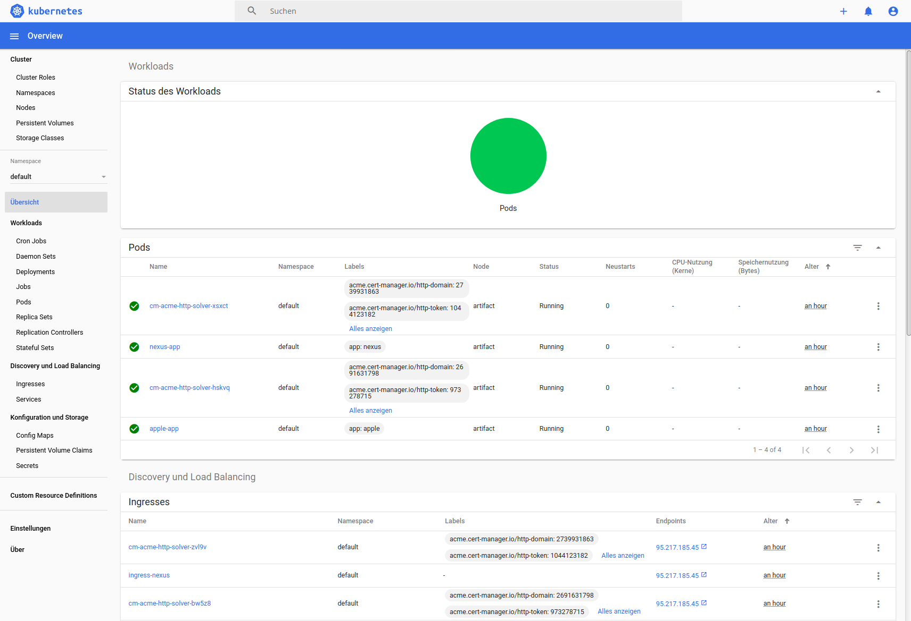

# dda-k8s-crate
[](https://clojars.org/dda/dda-k8s-crate)
[](https://travis-ci.org/DomainDrivenArchitecture/dda-k8s-crate)

[](https://clojurians.slack.com/messages/#dda-pallet/) | [ team@social.meissa-gmbh.de](https://social.meissa-gmbh.de/@team) | [Website & Blog](https://domaindrivenarchitecture.org)

This crate is part of [dda-pallet](https://domaindrivenarchitecture.org/pages/dda-pallet/).

This is a asciinema recording of the features of this crate:
[](https://asciinema.org/a/329800)

## Kubernetes setup

This crate sets up a K8s as SingleNode-Instance. Setup is based on ubuntu18.4

## Features

The Kubernetes cluster installed by this crate provides the following features:
* a single node all-in-one k8s system for serving one application in a cheap manner
* includes Ingress for the app to be installed (replacement of traditional reverse-proxy httpd)
* supports letsencrypt (dynamic created by https) for a defined fqdn or alternatively injected static https certs
* provides a dashboard for defined users with anonymous access disabled
* secure enough for serving applications to the internet.

### dda-k8s in detail

We use the following components:
* Flannel networking: [[Flannel]](https://github.com/coreos/flannel#flannel), [[Kubernetes Cluster Networking]](https://kubernetes.io/docs/concepts/cluster-administration/networking/)
* metallb: [[MetalLB]](https://metallb.universe.tf/)
* nginx-ingress: [[Ingress]](https://kubernetes.io/docs/concepts/services-networking/Ingress/)
* cert-manager: [[cert-manager]](tps://github.com/jetstack/cert-manager)
* dashboard 2.0: [[dashboard]](https://github.com/kubernetes/dashboard/)
* apple-echo for debugging: [[http-echo]](https://github.com/hashicorp/http-echo)
* nexus as example application: [[docker-nexus]](https://github.com/sonatype/docker-nexus)

k8s api and dashboard is eposed to localhost only and can be accesed through a ssh-tunnel, all k8s operations can be executed by a k8s user. Generated yml manifests can be found at '/home/k8s/k8s-resources'

### Ingress and MetalLB

dda-k8s exposes its ingress to the outside by using metallb. The most important config for ingress and metallb options are:
* host-ip, where the ingress is exposed
* the fqdn for the Ingress instance (dns should point to the host-ip above)
* the (cluster-)issuer to be used with the Ingress instance

### Cert-manager and handling of https and certificates

We use cert-manager to issue certificates for us. There following issuers are available:
* a secret representing the CA-key pairs needs to be created
* a config file for the actual certificate needs to be created
* an issuer of either self-signed, CA-issuer or letsencrypt issuer

The self-signed issuer does not require a secret or certificate config file. For the letsencrypt issuer we distinguish between an issuer for staging and for production.

### Dashboard

The dashboard allows for debugging and to get an overview of the Kubernetes cluster and should later also provide networking. To secure the dashboard, an ssh proxy is required and the dashboard can then be accessed via a http://localhost:8001/api/v1/namespaces/kubernetes-dashboard/services/https:kubernetes-dashboard:/proxy in the browser.

```
 ssh k8s@k8s-server-name -L 8001:localhost:8001
 kubectl proxy &
 # you need to authorize as k8s or have your public_key under k8s authorized_keys
 # you can get the authorize token with this command
 kubectl -n kube-system describe secret admin-user| awk '$1=="token:"{print $2}'
 ```

 You can use the dashboard for monitoring, debugging or checking the state of pods like we do in this screenshot:

 

### Apple application for debugging


### Nexus repository manager

The nexus repository manager uses certmanager for certificates. The storage is relized as PersistentVolume.

## Compatibility
dda-pallet is compatible with the following versions
* jvm11 or later
* clojure 1.9 or later
* pallet 0.8.x
* (x)ubunutu 18.04

### Watch log for debug reasons
In case of problems you may want to have a look at the log-file:
`less logs/pallet.log`

### Targets

You can define provisioning targets using the [targets-schema](https://github.com/DomainDrivenArchitecture/dda-pallet-commons/blob/master/doc/existing_spec.md)

### Domain API

You can use our conventions as a starting point:
[see domain reference](doc/reference_domain.md)

### Infra API

Or you can build your own conventions using our low level infra API. We will keep this API backward compatible whenever possible:
[see infra reference](doc/reference_infra.md)

## License

Copyright © 2018, 2019 meissa GmbH
Licensed under the [Apache License, Version 2.0](LICENSE) (the "License")
Pls. find licenses of our subcomponents [here](doc/SUBCOMPONENT_LICENSE)
